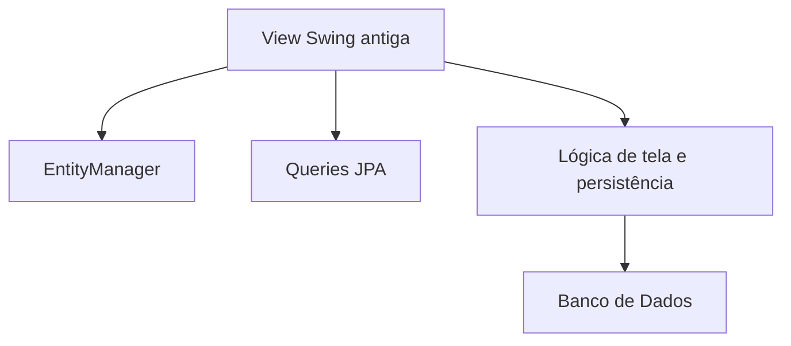
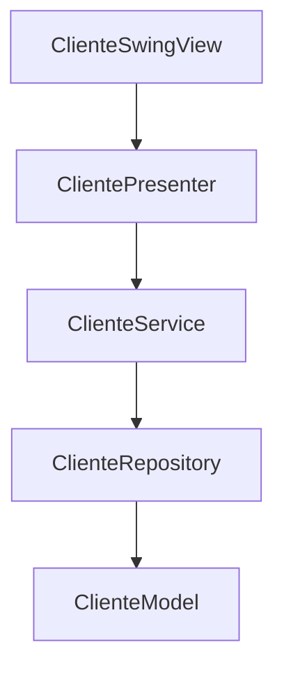

# Refatoração para MVP do módulo Cliente

## Objetivo
Separar a interface, a lógica de negócio e o acesso a dados para reduzir o acoplamento no sistema Swing legado.

## Arquitetura anterior
O sistema original concentrava a responsabilidade de apresentação, consulta e manipulação de dados na própria tela Swing, como em [Prime-SistemaComercial/src/prime/view/ClienteView.java](Prime-SistemaComercial/src/prime/view/ClienteView.java).

## Arquitetura proposta com MVP
A refatoração piloto separou as responsabilidades em camadas claras: view, presenter, service e repository.

## Estrutura criada
- model: [Prime-SistemaComercial/src/prime/mvp/cliente/model/ClienteModel.java](Prime-SistemaComercial/src/prime/mvp/cliente/model/ClienteModel.java)
- view: [Prime-SistemaComercial/src/prime/mvp/cliente/view/ClienteSwingView.java](Prime-SistemaComercial/src/prime/mvp/cliente/view/ClienteSwingView.java) e [Prime-SistemaComercial/src/prime/mvp/cliente/view/ClienteViewContract.java](Prime-SistemaComercial/src/prime/mvp/cliente/view/ClienteViewContract.java)
- presenter: [Prime-SistemaComercial/src/prime/mvp/cliente/presenter/ClientePresenter.java](Prime-SistemaComercial/src/prime/mvp/cliente/presenter/ClientePresenter.java)
- service: [Prime-SistemaComercial/src/prime/mvp/cliente/service/ClienteService.java](Prime-SistemaComercial/src/prime/mvp/cliente/service/ClienteService.java)
- repository: [Prime-SistemaComercial/src/prime/mvp/cliente/repository/ClienteJpaRepository.java](Prime-SistemaComercial/src/prime/mvp/cliente/repository/ClienteJpaRepository.java)

## Fluxo de execução
1. A tela inicializa o presenter.
2. O presenter solicita os clientes ao service.
3. O service delega a leitura ao repository.
4. A view exibe os dados e permite salvar ou remover.

## Benefícios alcançados
- separação de responsabilidades
- menor acoplamento entre interface e regras de negócio
- base preparada para evolução para persistência real
- estrutura mais fácil de testar e manter

## Ponto de entrada alterado
A classe principal agora abre a nova view MVP em [Prime-SistemaComercial/src/prime/Main.java](Prime-SistemaComercial/src/prime/Main.java).

## Resumo executivo
A refatoração foi iniciada com foco no módulo Cliente, que é um ponto representativo do sistema porque concentra operações de cadastro e consulta. A mudança buscou retirar da interface a responsabilidade de controlar regras e persistência, deixando a tela apenas como ponto de interação com o usuário.

## Impacto esperado
- melhoria na organização do código
- facilitação da manutenção futura
- melhor base para evolução para uma arquitetura mais modular
- possibilidade de expansão para os demais módulos do sistema

## Conclusão
A estrutura MVP foi introduzida com sucesso como primeira etapa de modernização do sistema legado, oferecendo uma base clara para a continuidade da refatoração e para a apresentação acadêmica do trabalho.

## Evidência de execução
A validação foi feita com sucesso no ambiente local:
- compilação do fluxo MVP concluída com sucesso;
- execução da aplicação no modo console retornou a listagem de clientes e a mensagem de cadastro realizado.
